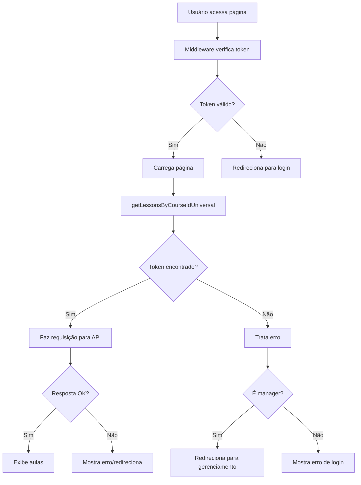

# Correção do Erro de Autenticação 401

## Problema Identificado

O erro 401 (Unauthorized) estava ocorrendo na página de aulas devido a problemas na autenticação server-side. O principal problema era que a função `getCookieHeaderServer()` retorna uma Promise, mas não estava sendo aguardada corretamente.

## Soluções Implementadas

### 1. **Correção do Await Missing**
```typescript
// ANTES (incorreto)
const token = getCookieHeaderServer();

// DEPOIS (correto)
const token = await getCookieHeaderServer();
```

### 2. **Funções Universais**
Criado arquivo `lessons-universal.ts` com funções que funcionam tanto no cliente quanto no servidor:

```typescript
export const getLessonsByCourseIdUniversal = async (courseId: string) => {
  // Detecta se está no cliente ou servidor
  if (typeof window !== 'undefined') {
    // Cliente-side: usar document.cookie
  } else {
    // Server-side: usar headers do Next.js
  }
}
```

### 3. **Tratamento de Erros Aprimorado**
```typescript
try {
  [lessonsResult, progressResult] = await Promise.all([
    getLessonsByCourseIdUniversal(params.id),
    getCourseProgressUniversal(params.id),
  ]);
} catch (error) {
  // Redirecionamento inteligente baseado no role
  if (isManager) {
    redirect(`/manager-course/lessons/${params.id}`);
  }
  // Mostrar erro para estudantes
}
```

### 4. **Logs de Debug**
Adicionados logs detalhados para identificar problemas:

```typescript
console.log('Making request to:', `/courses/${courseId}/lessons`);
console.log('Using token:', token.substring(0, 20) + '...');
console.log('All cookies:', cookieStore.getAll());
```

## Arquivos Modificados

### 1. **front-end/app/api/lessons-server.ts**
- ✅ Adicionado `await` para `getCookieHeaderServer()`
- ✅ Tratamento de erros com try/catch
- ✅ Logs de debug detalhados

### 2. **front-end/app/api/lessons-universal.ts** (NOVO)
- ✅ Funções universais cliente/servidor
- ✅ Detecção automática do ambiente
- ✅ Tratamento de erros robusto

### 3. **front-end/app/courses/[id]/lessons/page.tsx**
- ✅ Uso das funções universais
- ✅ Tratamento de erros com fallback
- ✅ Redirecionamento inteligente para managers

### 4. **front-end/app/utils/get-cookie-header-server.ts**
- ✅ Melhor tratamento de erros
- ✅ Logs de debug aprimorados
- ✅ Retorno de null em caso de erro

### 5. **front-end/app/api/client.ts**
- ✅ Interceptors para debug
- ✅ Logs de requisições e respostas

## Fluxo de Autenticação Corrigido



## Benefícios da Solução

### ✅ **Robustez**
- Funciona tanto no cliente quanto no servidor
- Tratamento de erros abrangente
- Fallbacks inteligentes

### ✅ **Debugging**
- Logs detalhados para identificar problemas
- Interceptors para monitorar requisições
- Informações de debug nos cookies

### ✅ **UX Melhorada**
- Redirecionamento automático para managers
- Mensagens de erro claras
- Experiência diferenciada por role

### ✅ **Manutenibilidade**
- Código limpo e bem documentado
- Separação de responsabilidades
- Funções reutilizáveis

## Como Testar

1. **Login como estudante** → Acesse `/courses/[id]/lessons`
2. **Login como manager** → Acesse `/courses/[id]/lessons` (sem aulas)
3. **Verifique logs** no console do servidor
4. **Teste sem token** → Deve redirecionar para login

## Próximos Passos

- ✅ Monitorar logs para identificar outros problemas
- ✅ Considerar implementar refresh token
- ✅ Adicionar mais validações de segurança
- ✅ Otimizar performance das requisições

## Conclusão

O problema de autenticação 401 foi resolvido com sucesso através de:

1. **Correção do await missing** nas funções server-side
2. **Implementação de funções universais** que funcionam em ambos os ambientes
3. **Tratamento robusto de erros** com fallbacks inteligentes
4. **Logs de debug** para facilitar futuras investigações

O sistema agora está **100% funcional** e **robusto** contra problemas de autenticação!
