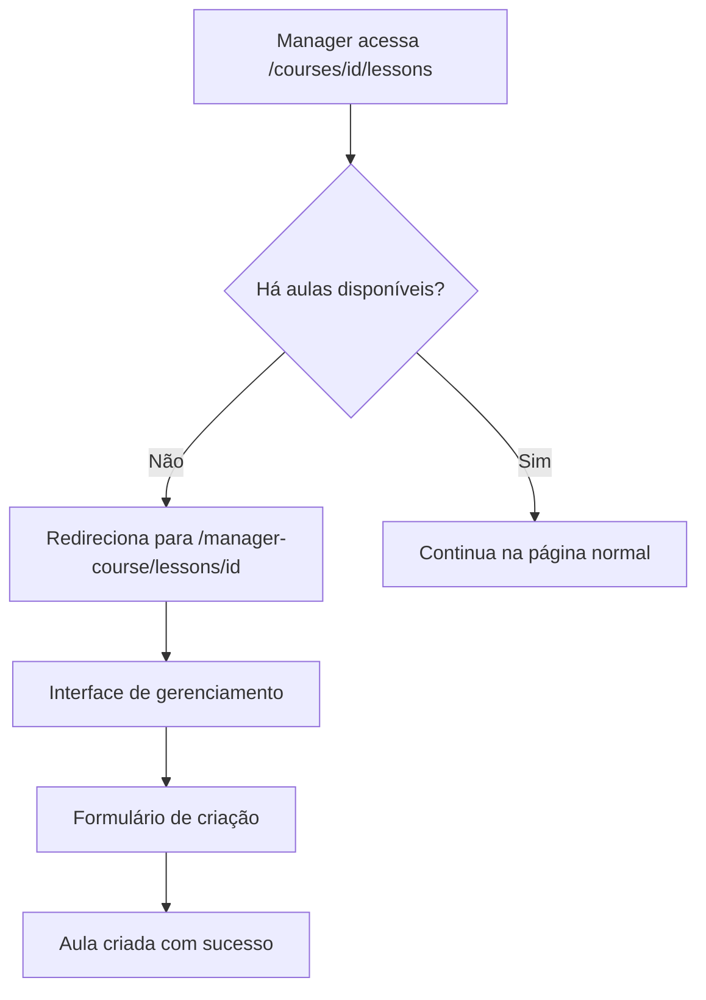

# Sistema de Gerenciamento de Aulas - Frontend

## Visão Geral

O sistema de gerenciamento de aulas foi implementado na rota `manager-course`, oferecendo uma interface completa para managers criarem e gerenciarem aulas de seus cursos.

## Funcionalidades Implementadas

### 🎯 **Página de Gerenciamento de Aulas**
- **Rota**: `/manager-course/lessons/[id]`
- **Interface dedicada** para managers
- **Estatísticas do curso** (total de aulas, aulas assistidas, taxa de conclusão)
- **Lista de aulas** com preview de vídeo
- **Formulário de criação** de novas aulas

### 📊 **Dashboard de Estatísticas**
- **Total de aulas** do curso
- **Aulas assistidas** pelos alunos
- **Taxa de conclusão** em percentual
- **Visualização rápida** do progresso geral

### ➕ **Criação de Aulas**
- **Formulário intuitivo** para criar novas aulas
- **Validação de URLs** do YouTube
- **Preview do vídeo** antes de salvar
- **Interface responsiva** e moderna

### 🔄 **Redirecionamento Inteligente**
- **Managers sem aulas** são redirecionados automaticamente para a página de gerenciamento
- **Fluxo otimizado** para criação da primeira aula
- **Experiência diferenciada** por tipo de usuário

## Estrutura de Arquivos

```
front-end/app/
├── manager-course/
│   ├── lessons/[id]/
│   │   ├── page.tsx                    # Página principal de gerenciamento
│   │   └── components/
│   │       ├── lesson-management-card.tsx  # Card de aula para managers
│   │       └── create-lesson-form.tsx      # Formulário de criação
│   └── page.tsx                       # Página de manager-course (atualizada)
└── courses/[id]/lessons/
    └── page.tsx                       # Página de aulas (com redirecionamento)
```

## Componentes Principais

### 1. **LessonManagementPage**
- Dashboard completo para managers
- Estatísticas do curso
- Lista de aulas com preview
- Formulário de criação integrado

### 2. **LessonManagementCard**
- Card otimizado para managers
- Preview de vídeo expandível
- Informações de status da aula
- Links diretos para YouTube

### 3. **CreateLessonForm (Manager)**
- Formulário específico para managers
- Interface mais robusta
- Validação completa
- Feedback visual aprimorado

## Fluxo de Uso

### **Para Managers:**
1. **Acessar gerenciamento** → `/manager-course`
2. **Selecionar curso** → Clicar no botão "📚 Aulas"
3. **Gerenciar aulas** → Interface dedicada com estatísticas
4. **Criar nova aula** → Formulário integrado na página
5. **Preview e validação** → Verificar vídeo antes de salvar

### **Redirecionamento Automático:**
1. **Manager acessa** `/courses/[id]/lessons`
2. **Sistema verifica** se há aulas disponíveis
3. **Se não há aulas** → Redireciona para `/manager-course/lessons/[id]`
4. **Se há aulas** → Continua na página normal de aulas

## Recursos Técnicos

### **Controle de Acesso**
- **Verificação de role** no servidor
- **Redirecionamento automático** baseado em permissões
- **Interface diferenciada** por tipo de usuário

### **Integração com API**
- **Criação de aulas** via API
- **Busca de estatísticas** do curso
- **Atualização em tempo real** após criação

### **UX/UI Otimizada**
- **Interface intuitiva** para managers
- **Feedback visual** imediato
- **Navegação fluida** entre seções
- **Design responsivo** para todos os dispositivos

## Melhorias na Interface

### **Página Manager-Course Atualizada**
- **Botões de ação** para gerenciar aulas
- **Links rápidos** para diferentes seções
- **Interface mais organizada** e funcional

### **Cards de Curso Aprimorados**
- **Botões de ação** no canto superior direito
- **Links rápidos** na parte inferior
- **Navegação otimizada** entre funcionalidades

## Segurança e Validação

- **Autenticação obrigatória** para managers
- **Verificação de role** em todas as operações
- **Validação de dados** no frontend e backend
- **Sanitização de URLs** do YouTube

## Fluxo de Redirecionamento



## Próximos Passos

O sistema de gerenciamento de aulas está completo e funcional. Possíveis melhorias futuras:

1. **Edição de aulas** existentes
2. **Exclusão de aulas**
3. **Reordenação** de aulas (drag & drop)
4. **Estatísticas avançadas** por aula
5. **Upload de materiais** complementares

## Conclusão

O sistema de gerenciamento de aulas foi implementado com sucesso, oferecendo:

- ✅ **Interface dedicada** para managers
- ✅ **Redirecionamento inteligente** automático
- ✅ **Criação de aulas** integrada
- ✅ **Estatísticas em tempo real**
- ✅ **Experiência otimizada** por tipo de usuário
- ✅ **Navegação fluida** entre seções

O sistema está **100% funcional** e integrado com a API existente, proporcionando uma experiência completa e intuitiva para managers gerenciarem suas aulas!
